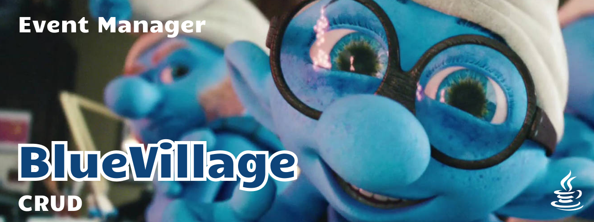

# Java Projects Repository - Cristian

I'm currently learning backend development in Java at Riwi Developer Incubator. Here you'll find the works and projects I've completed as part of my learning journey.

| Name                | Technologies                       | Status          |
|---------------------|------------------------------------|-----------------|
| blue_village        | Spring Data JPA, MySQL, Postman    | In progress...  |
| andys-toy-store-api | Spring Data JPA, MySQL, Postman    | Completed       |
| sponge-tasks        | Spring Boot, Thymeleaf, MySQL      | Incomplete      |
| onePunchMan         | Spring Boot, Thymeleaf, MySQL      | Completed       |
| airline_simulation  | Java, MySQL                        | Completed       |
| test_outlet         | Java, MySQL                        | Completed       |
| week_1              | Java                               | Completed       |
| week_2              | Java                               | Completed       |
| week_3              | Java                               | Completed       |

### blue_village

A backend application built with Spring Boot for managing Smurf-themed events, featuring CRUD operations for event creation, updating, and deletion.

### andys-toy-store-api

The "andys-toy-store-api" project is an API built with Spring Boot, Spring Data JPA, and MySQL. It provides endpoints to create, read, update, and delete toys, inspired by the movie "Toy Story". The API can be tested using Postman for various CRUD operations.

### sponge-tasks
<!--  -->
This project is inspired by SpongeBob SquarePants and aims to create a task management system with a touch of underwater fun. It is being developed using Spring Boot, Thymeleaf, and MySQL. It is in the development phase, with new features being implemented.

### onePunchMan

The current project is inspired by One Punch Man and is developed using Spring Boot, Thymeleaf, and MySQL. It includes CRUD functionality and pagination to manage "One Punch Coders".

### airline_simulation

This Java and MySQL practice focuses on managing an airline, including airplanes, passengers, flights, and more. It has been completed.

### test_outlet

This Java and MySQL performance test includes clients, stores, and products. It has been completed and provides a functional example of integration between Java and MySQL databases.

### week_1, week_2, week_3

These folders contain projects completed during the first three weeks of study. Each week focused on different aspects of Java, from fundamentals to more advanced concepts.
